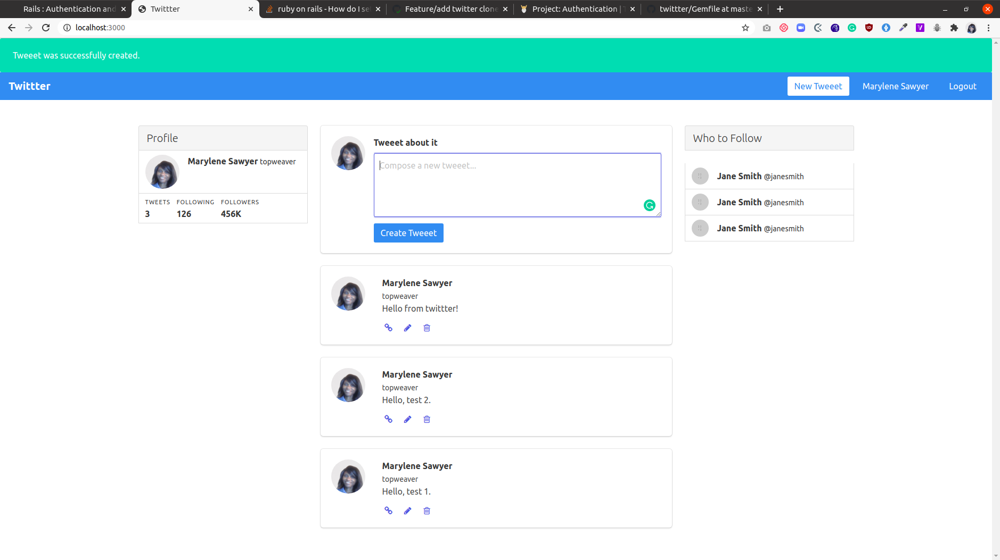

# twittter

This is a project in the Ruby on Rails curriculum at [Microverse](https:www.microverse.org/) - @microverseinc

The project specifications can be found on [Ruby on Rails
PROJECT: AUTHENTICATION](https://www.theodinproject.com/courses/ruby-on-rails/lessons/authentication)



## Built With
- Ruby
- Rails 

## Description
- This project is mainly about [sessions, cookies and authentication](https://www.theodinproject.com/courses/ruby-on-rails/lessons/authentication).

- The Rails framework was used to build this project.

## Live Demo

[Deployed site]()

### Run instructions 
-  You can clone the GitHub repo and type the following commands in the terminal to run the bot locally 
    ```
    bundle install
    rake db:migrate
    rails server
    ```

### How to use the site
Make sure the server is running
- Go to http://localhost:3000/ in your web browser
- You will be able to access the following routes (among others)
  - http://localhost:3000/users/sign_up: where you can register to compose and edit tweets.
  - http://localhost:3000/users/edit: where you can edit an existing twittter account.
  - http://localhost:3000/users/sign_in: where you can sigin to tweeet and edit tweeets.
- Follow the links on the site to access the available features.

## Deployment
- You can deploy on [Heroku](https://devcenter.heroku.com/categories/ruby-support).

## Authors

👤 **Marylene Sawyer**
- Github: [@Bluette1](https://github.com/Bluette1)
- Twitter: [@MaryleneSawyer](https://twitter.com/MaryleneSawyer)
- Linkedin: [Marylene Sawyer](https://www.linkedin.com/in/marylene-sawyer)


# Acknowledgements
- [AUTHENTICATION AND SENDING CONFIRMATION EMAIL USING DEVISE 2020](https://www.bogotobogo.com/RubyOnRails/RubyOnRails_Devise_Authentication_Sending_Confirmation_Email.php)


## 🤝 Contributing

Contributions, issues and feature requests are welcome!

Feel free to check the [issues page](https://github.com/Bluette1/minderly-bot/issues).

## Show your support

Give a ⭐️ if you like this project!

## 📝 License

This project is [MIT](https://opensource.org/licenses/MIT) licensed.
